# 🐘 PostgreSQL Database Backup Tool

[](https://go.dev/doc/install)
[](https://www.microsoft.com/windows)
[](https://www.postgresql.org/)

[English](#english)

> 💡 **Automated PostgreSQL backup tool for Windows** - Backs up multiple schemas concurrently with zero configuration

<p align="center">
  
</p>

## 📖 Story

I grew up using Windows, so when I decided to learn coding, I chose a Windows laptop because it was the most convenient for me. I use PostgreSQL extensively every day, so I created this tool to back up my databases **easily** and **quickly**.

While cloud databases like AWS, GCP, or Azure offer their own backup solutions, this tool is perfect if you're using a local PostgreSQL server or need an additional backup layer.

## 📂 Project Structure

```
backup/
├── backupFunc/                           # Contains backup execution functions
│   └── backupFunc.go                     # Core backup functionality
├── backups/                              # Backup files directory (this directory will be created automatically)
├── config/                               # Configuration management
│   ├── addingPath/                       # PostgreSQL path utilities
│   ├── checkPsqlLatestVersion/           # Version checking utilities
│   ├── checkPsqlVersionExistOnWindows/   # Install verification
│   ├── dbconfig/                         # Database configuration utilities
│   ├── downloadPsqlInstaller/            # PostgreSQL installer download utilities
│   ├── getCurrentFolderPath/             # Current folder path utilities
│   └── installPsql/                      # PostgreSQL installation utilities
├── model/                                # Data structures and constants
├── .env                                  # Environment variables (this file needs to be created, read the README for details)
├── .gitignore                            # Git ignore file
├── main.go                               # Application entry point
└── README.md                             # Project documentation
```

This repository contains a Go application for creating automated PostgreSQL database backups. The tool connects to
PostgreSQL databases, verifies compatibility, and creates backups of specified schemas.

## ✨ Features

- 📝 **Simple Configuration** - Environment variable setup via `.env` file
- 🔄 **Auto-Detection** - PostgreSQL version detection and compatibility checking
- 🔧 **Zero Setup** - Automatic PostgreSQL tools installation if needed
- ⚡ **Performance** - Concurrent backup processing for multiple schemas
- 🛠️ **Customizable** - Easy to add new schemas for backup
- 🔒 **Secure** - Credentials stored locally only

## 🔍 How It Works

<div align="center">
  
</div>

1. Configuration Check: Reads from .env or prompts for credentials
2. PostgreSQL Tools Check: Verifies if proper tools are installed
3. Auto-Installation: Downloads and installs PostgreSQL tools if needed
4. Version Detection: Identifies database version for compatibility
5. Concurrent Backup: Runs multiple schema backups in parallel
6. Backup Storage: Organizes backups by schema and date

## 🚀 Quick Start

### Prerequisites

- Windows operating system
- Go 1.23.1 or higher
- PostgreSQL database (if not installed, the application will prompt for installation)

## Setup

1. Clone the repository:
   ```bash
   git clone https://github.com/ngxvu/PGBackup.git
   cd .\PGBackup\

2. Create a `.env` file in the root directory with the following configuration:
```
DB_HOST=your_database_host
DB_PORT=your_database_port
DB_DATABASE=your_database_name
DB_USERNAME=your_username
DB_PASSWORD=your_password
```
**If any variables are missing, the application will prompt you for them interactively.**

3. Run the application:
```
go run main.go
```

## 🛠️ Creating Custom Backups

You can extend the tool to back up additional schemas by using the `BackupDatabase()` function at `backupFunc/backupFunc.go`. This function is designed to back up a specific schema in your PostgreSQL database.

### Function Definition:

```go
func BackupDatabase(creds *model.DatabaseCredentials, version, schema string) error
```

### Parameters:
- `creds`: Database credentials (e.g., username, password, host, etc.)
- `version`: PostgreSQL version (automatically detected by the tool)
- `schema`: The schema name to back up (e.g., "public", "your_custom_schema_name")

### Example Implementation:
To back up a new schema, create a new function like this:

```go
func BackupDatabaseNewSchema(creds *model.DatabaseCredentials, version string) error {
return BackupDatabase(creds, version, "new_schema")
}
```

Integrating the New Schema Backup
Add the new schema backup to the PerformDatabaseBackups() function. For example:

```go
go func () {
defer wg.Done()
if err := BackupDatabaseCustomSchema(creds, addPathVersion); err != nil {
errChan <- fmt.Errorf("error backing up custom schema: %v", err)
}
}()
```

Updated PerformDatabaseBackups() Function
Here is the updated PerformDatabaseBackups() function with the new schema backup included:

```go
func PerformDatabaseBackups(creds *model.DatabaseCredentials, version string) error {
	
var wg sync.WaitGroup
wgCount := 2
errChan := make(chan error, wgCount)

wg.Add(wgCount)

go func () {
defer wg.Done()
if err := BackupDatabase(creds, version, "public"); err != nil {
errChan <- fmt.Errorf("error backing up public schema: %v", err)
}
}()
go func () {
defer wg.Done()
if err := BackupDatabaseCustomSchema(creds, version, "new_schema"); err != nil {
errChan <- fmt.Errorf("error backing up new schema: %v", err)
}
}()

wg.Wait()
close(errChan)

for err := range errChan {
return err
}

return nil
}
```
By following these steps, you can easily add support for backing up additional schemas.

## ❓ FAQ
<details> <summary>Will this work on Linux or macOS?</summary> Currently, this tool is designed specifically for Windows. Path handling and PostgreSQL installation would need modifications for other operating systems. </details> <details> <summary>How large of a database can this tool handle?</summary> The tool uses the standard PostgreSQL pg_dump utility, so it inherits the same limitations. For very large databases (several GB), expect the process to take longer. </details> <details> <summary>Where are my backups stored?</summary> Backups are stored in the backups/ directory, organized by schema name with timestamped filenames. </details> <details> <summary>Can I schedule automated backups?</summary> Yes! Use Windows Task Scheduler to run the application at scheduled intervals. </details>

## 🤝 Contributing
Contributions are welcome! Here's how you can help:

1. Fork the repository
2. Create a feature branch: git checkout -b new-feature
3. Commit your changes: git commit -am 'Add new feature'
4. Push the branch: git push origin new-feature
5. Submit a pull request

## 📄 License
This project is licensed under the MIT License - see the LICENSE file for details.
<hr> Made with ❤️ by ngxvu </hr>